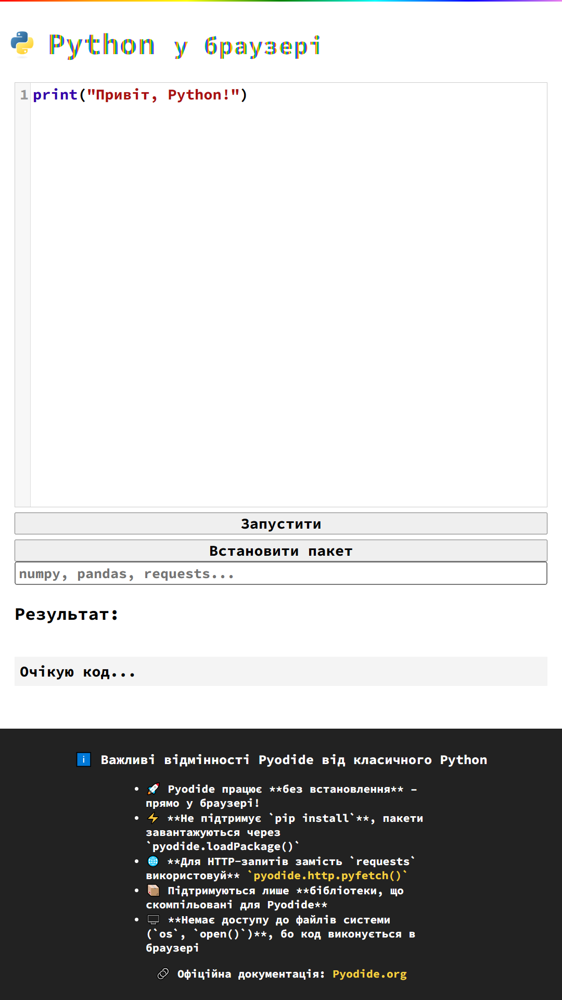

# Python у браузері

Цей проект демонструє можливість запуску Python-коду безпосередньо у браузері за допомогою Pyodide. Інтерфейс містить редактор коду, кнопку запуску та поле для виводу результатів виконання.

## 🚀 Основні можливості
- Виконання Python-коду прямо у браузері
- Встановлення бібліотек Pyodide
- Використання CodeMirror для підсвічування синтаксису
- Миттєвий вивід результату виконання

## 📂 Структура проекту
- `index.html` – основний HTML-документ
- `style.css` – стилі для сторінки
- `app.js` – головна логіка роботи з Pyodide

## 📜 Використані технології
- **Pyodide** – Python для браузера
- **CodeMirror** – редактор коду
- **JavaScript** – інтеграція Pyodide
- **HTML + CSS** – структура та стилізація сторінки

## 🔧 Інструкція з використання
1. Відкрити сторінку у браузері
2. Написати або змінити Python-код у редакторі
3. Натиснути кнопку "Запустити"
4. Побачити результат у полі виводу

## 🌐 Демо
Проект доступний онлайн: [Python у браузері](https://vadim4web.github.io/python/)

## 🛠 Важливі особливості Pyodide
- **Не підтримує `pip install`**, використовується `pyodide.loadPackage()`
- **Використання `pyfetch()` замість `requests`**
- **Немає доступу до файлової системи**

## 📢 Автор
© Vadim Chervoniak

